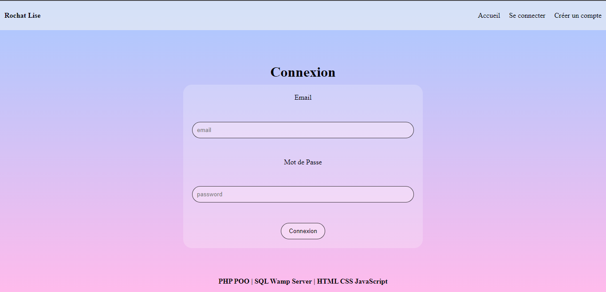

<div id="top"></div>

<div align="center">
  <h1> Registration - Connection </h1>
  <p>Form Registration and Form Connection</p>
</div>

***

### Table of Content
1. [General Info](#general-info)
3. [Visual](#visual)
4. [Technologies](#technologies)
5. [Installation](#installation)
6. [Road Map](#roadmap)
7. [Contributing](#contributing)
8. [Contact](#contact)
<p align="right">(<a href="#top">back to top</a>)</p>

***

### General Info
Realization of a complete user account management in PHP (MVC / CRUD) 
- Creation and validation of account by email
- Login
- Account management
- Securing (Password, Session, Cookie)
- Role Management
<p align="right">(<a href="#top">back to top</a>)</p>

***

### Visual
Here is an overview of project. </br>

<p align="right">(<a href="#top">back to top</a>)</p>

***

### Technologies
- HTML 5
- CSS 3
- Javascript
- sql
- PHP
<p align="right">(<a href="#top">back to top</a>)</p>

***

### Installation

1. Clone the project
```
git clone https://github.com/LiseRochat/Registration-Login
```
2. Open file with you text editor 
3. Create a bdd with name **connection** in your phpmyadmin
4. Import sql file in bdd
5. Initialize bdd variables 
6. Run :
 ```
  localhost/Registration-Login
 ```
 7. If you just want test connection use :
    -  **ADMIN** <br>
        **email** : admin@gmail.com <br>
        **password** : azerty <br>
    - **USER** <br>
        **email** : user@milou.fr <br>
        **password** : tintin <br>
<p align="right">(<a href="#top">back to top</a>)</p> <br>

***

### RoadMap
- [x] Connection
- [x] Inscription
- [x] Edit Profil
    - [x] Email
    - [x] Password
    - [x] Avatar
    - [x] Delete Account
- [x] Admin

***

### Contributing
If you have a suggestion that would make this better, please fork the repository and create a pull request. You can also simply open an issue with the tag "enhancement".

Don't forget to give the project a star! Thanks again!

1. Fork the Project
2. Create your Feature Branch (`git checkout -b feature/AmazingFeature`)
3. Commit your Changes (`git commit -m 'Add some AmazingFeature'`)
4. Push to the Branch (`git push origin feature/AmazingFeature`)
5. Open a Pull Request
<p align="right">(<a href="#top">back to top</a>)</p>

***

### Contact 
Rochat Lise - liserochat@live.fr </br>
Project Link: [https://github.com/LiseRochat/Registration-Login](https://github.com/LiseRochat/Registration-Login)
<p align="right">(<a href="#top">back to top</a>)</p>


